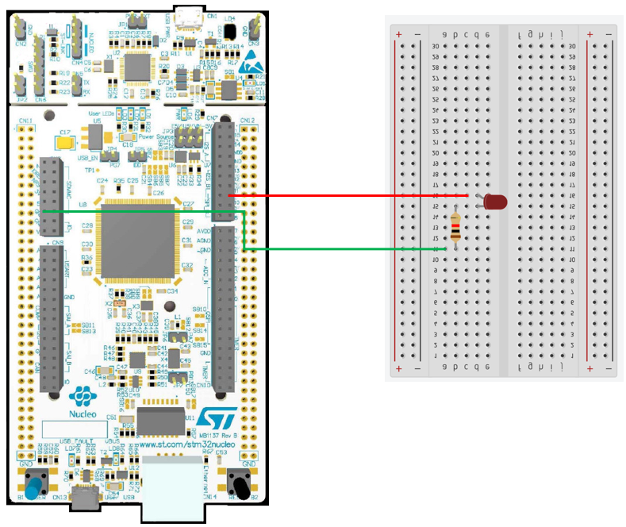

# STM32 Project - 呼吸燈

這是一個用於 STM32F4 系列微控制器的示例項目，旨在調整 LED 燈的亮度

## 硬件要求

- STM32F429ZIT6 微控制器
- LED

## 軟件依賴

- STM32CubeIDE

## 學習目標

- 使用 PWM，讓 LED 顯示不同亮度

## 電路圖

## 構建和編譯

1. 將資料夾放入 STM32CubeIDE 的 WorkSpace 中
2. 在 STM32CubeIDE 中打開 .cproject
3. 編譯並燒寫至您的微控制器

## 使用方法

將編譯好的程序燒寫到 STM32 微控制器後，LED 會慢慢變亮和慢慢變暗。
